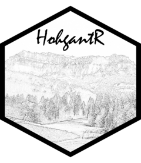

<!-- README.md is generated from README.Rmd. Please edit that file -->

# HohgantR 

<!-- badges: start -->

[](https://forthebadge.com)
[](https://github.com/BBieri/HohgantR)
[](https://lifecycle.r-lib.org/articles/stages.html#experimental)
<!-- badges: end -->

The goal of HohgantR is to serve as a toolbox filled with all the
miscellaneous functions that might be useful one day, or not…

## Installation

You can install the latest version of HohgantR from
[GitHub](https://github.com/) with:

``` r
# install.packages("devtools")
devtools::install_github("BBieri/HohgantR")
```

A release on CRAN is not planned as the package is intended to serve as
a “cabinet de curiosités” of R functions.

## Bernie’s theme

A `{ggplot2}` theme for Bernie’s blog.

``` r
library(HohgantR)
library(tidyverse)
# Prepare data
cty_mpg <- aggregate(mpg$cty, by = list(mpg$manufacturer), FUN = mean)
colnames(cty_mpg) <- c("make", "mileage") # change column names
cty_mpg <- cty_mpg[order(cty_mpg$mileage), ] # sort
cty_mpg$make <- factor(cty_mpg$make, levels = cty_mpg$make)
# Plot
ggplot(cty_mpg, aes(x = make, y = mileage)) +
  geom_segment(aes(
    x = make,
    xend = make,
    y = 0,
    yend = mileage
  ), color = "white") +
  geom_point(size = 3, color = "orange") +
  labs(
    title = "Lollipop Chart",
    subtitle = "Make Vs Avg. Mileage",
    caption = "source: mpg"
  ) +
  HohgantR::themebernie() +
  theme(axis.text.x = element_text(angle = 65, vjust = 0.6))
```


